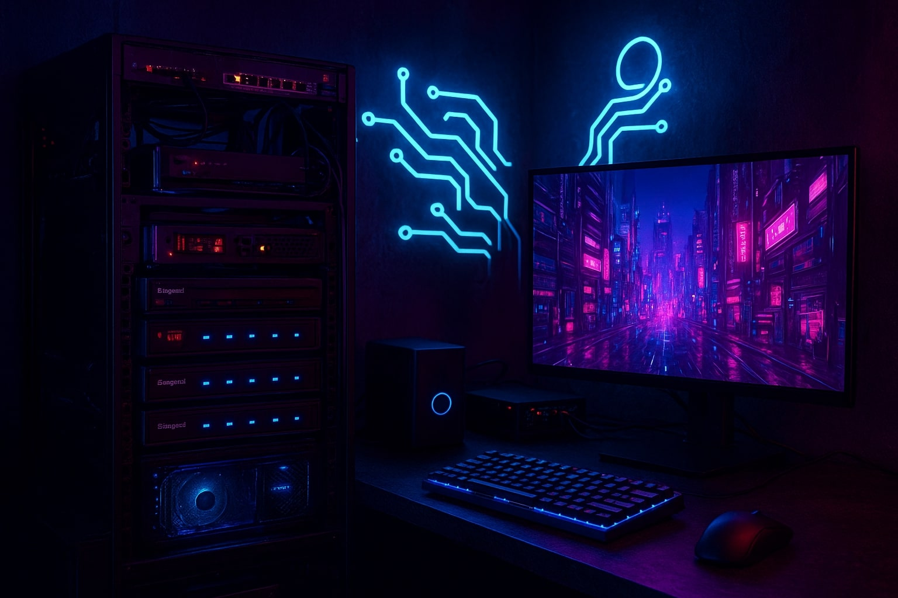

My homelab supports self-hosted services, storage and backups, virtualization, home automation, network monitoring, and hands-on testing.

## Hardware

### Compute & Storage

- **Custom-built Unraid Server**  
  Primary file server for media, shared storage, workstation backups, virtual-machine backups, and Docker container data. It also supports video editing and rendering workloads.
  - Cooler Master HAF XB EVO case
  - AMD Ryzen 9 5900X — 12 cores / 24 threads @ 3.7 GHz
  - 64GB DDR4-3200 RAM
  - 4× 12TB Seagate IronWolf HDDs
  - 500GB Samsung 970 EVO SSD cache drive
  - 1GbE NIC and 2.5GbE USB Ethernet adapter
  - Intel Arc A310 GPU for video output and transcoding
  - NVIDIA GTX 970 GPU for video rendering projects (will be removed in the future as my projects die down)

- **GMKtec K8 Plus Mini PC**  
  Primary Proxmox host for virtual machines, testing, and isolated project containers.
  - AMD Ryzen 7 8845HS — 8 cores / 16 threads @ 5.1 GHz
  - 96GB DDR5-5600 RAM
  - 1TB NVMe SSD
  - Dual 2.5GbE NICs

- **Lenovo M93p Tiny**  
  Secondary Proxmox host that runs an Ubuntu virtual machine for Docker workloads. This system replaced a previous Docker Swarm role to improve backup and restore workflows. Also because Docker Swarm was overkill for my actual use case.
  - Intel Core i5-4570T — 4 cores / 8 threads @ 2.9 GHz
  - 16GB DDR4 RAM
  - 500GB SATA SSD
  - 1GbE NIC and USB 1GbE Ethernet adapter

- **Lenovo M93p Tiny**  
  Dedicated host for a Docker-based Grafana and Prometheus monitoring stack. Primarily focused on pulling network-related data metrics.
  - Intel Core i5-4570T — 4 cores / 8 threads @ 2.9 GHz
  - 16GB DDR4 RAM
  - 500GB SATA SSD
  - 1GbE NIC

- **Raspberry Pi 4 Model B**  
  Dedicated Home Assistant host for home automation.
  - Broadcom BCM2711 quad-core Cortex-A72 processor @ 1.8 GHz
  - 4GB LPDDR4 RAM
  - 32GB microSD storage
  - 1GbE, 802.11ac Wi-Fi, and Bluetooth 5.0/BLE

### Networking

- **Qotom Q750G5-S08 Firewall**  
  Primary OPNsense firewall and router.
  - Intel Celeron J4125 with AES-NI
  - 8GB DDR4 RAM
  - 128GB SSD
  - 5× 2.5GbE ports
  - Runs OPNsense with Zenarmor Free

- **TP-Link Omada SG3428X-M2**  
  Main managed network switch.
  - 24× 2.5GbE ports
  - 4× 10Gb SFP+ ports
  - Managed through onboard Omada interface

- **UGREEN Switch**  
  Unmanaged front-room switch providing local connectivity and an uplink to the main network.
  - 5× 2.5GbE ports
  - 1× 10Gb SFP+ port

- **UniFi 7 Pro Access Point**  
  Primary wireless access point.
  - 2.5GbE uplink
  - Managed through a self-hosted UniFi controller

### Infrastructure & Accessories

- **15U Network Cabinet**
  - Top-mounted exhaust fan
  - Rack-mounted 10-outlet PDU

- **Power Protection**
  - CyberPower 1500VA UPS for the network rack
  - Separate CyberPower 1500VA UPS for the Unraid server and workbench equipment

- **GL.iNet Comet KVM (GL-RM1)**
  - Portable remote KVM solution
  - Supports up to 4K at 30Hz
  - Supports Tailscale for remote access

- **Bambu Lab A1 3D Printer**
  Mainly bought for printing Gridfinity organizational items, but have since expanded to printing network/IT items.
  - 256 × 256 × 256 mm build area volume
  - Connected to the wireless network

## Software & Services
  These are running between the Unraid and primary Docker servers.
- Thunderbird (used to provide always open spam filtering and email sorting)
- Home-Assistant
- FreshRSS
- Grocy
- Mealie
- Linkwarden
- Code-Server
- n8n
- Open-WebUI
- LiteLLM
- Guacamole
- Bambu Studio
- Jellyfin
- Radarr
- Sonarr
- Lidarr
- BookOrbit
- qBittorrent
- Jackett
- MeTube
- MySpeed
- PiHole
- LibreSpeed
- Gluetun
- UptimeKuma
- Grafana
- NetAlertX
- Proxmox Backup Server
- DockHand
- Gitea (used for tracking config changes to OPNsense and Docker Compose files)
