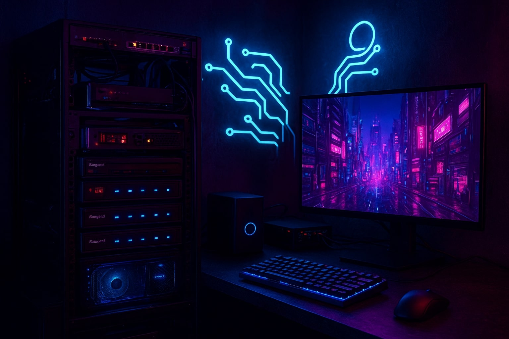

## Hardware

### Servers
- **Custom-built Unraid Server**: Primary NAS hosting shared folders for my network and backups. Also runs a set of media-oriented Docker services
  - Cooler Master HAF XB EVO case
  - MSI B450 TOMAHAWK MAX motherboard
  - AMD Ryzen 9 5900X 12-Core @ 3700 MHz
  - 64GB DDR4
  - 4x 12TB IronWolf HDD
  - 1x 500GB Samsung 970 EVO Plus SSD (cache drive)
  - Intel Arc 310 GPU (for video output and transcoding)
  - NVIDIA GTX 970 GPU (for video rendering projects)
- **3x Node Docker Cluster**: Hosts most of the micro-services I run at home and uses GlusterFS through a dedicated 5port gigabit switch to provide file syncing
  - Lenovo m93p mini PCs
  - Intel(R) Core(TM) i5-4570T @ 2.90GHz (2c/4t)
  - 16GB DDR4
  - 500GB SATA SSD
- **GMKtec K8 Plus Mini PC**: running Proxmox and primarily handling my [Cybersecurity Lab](./cybersecurity-lab.md)
  - AMD Ryzen 7 8845HS 8-Core(16T) @ 5.1 GHz
  - 96GB DDR5
  - 1TB Crucial NVME m.2 SSD
  - Dual 2.5GB NICs

### Networking
- **Qotom Q750G5-S08 Firewall**: Primary firewall for network running OPNsense.
  
## Software
  
- **Virtualization**:
  - **Proxmox VE**: Running on the GMKtec Mini PC
